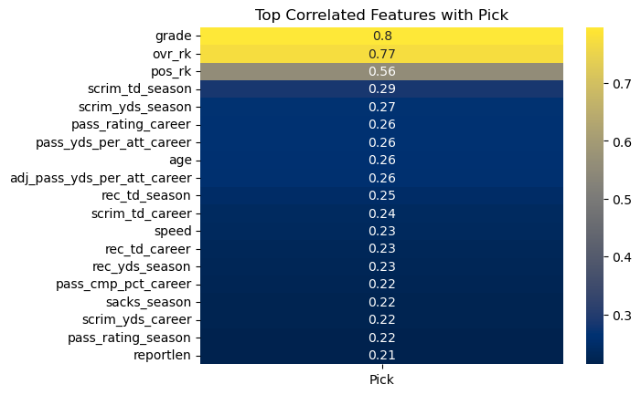

# NFL Draft Scouting Reports and Predictions

# **Author**: Josh Palgon

## Overview

The NFL Draft is the most important process in acquiring talented players. I am going to give any prespective team insight into when players will be selected.

I will be building upon the [Draft Combine](https://github.com/jpalgon/Draft_Stats) project I already completed.

The combine and college stats data was web scraped from sports-reference.com in the Draft Combine project. The scouting reports and draft grades were taken from ESPN.

The length of the scouting report is a decent indicator of where in the draft a player will be taken.

Overall player rank and draft grade were by far the most important features in determining where a player will get selected. This not surprising at all as teams are trying to pick the best players. 

My model was better at predicting the first round of the draft than any other round.

## Business Problem

Any NFL team is always looking for any minor edge to build a better football team. With the NFL Draft being the best way to improve a team, being able to know when a player will get drafted would be extremely valuable.

There are several significant applications to predicting when a player will get drafted. The biggest may be knowing what range a team will have to trade up to select a player of interest to them. If a team trades up too early they will have to give up extra draft capital to acquire the player and if they wait too long they will miss out on the player entirely. My model can give them a more precise range so they can maximize their draft capital while being able to acquire the player of interest. Additionally it could be used for tie-breaker scenarios. By selecting the player who is likely to get drafted earlier, there is a chance that they can select the other player later in the draft.

## Data

The combine and college stats data was web scraped from sports-reference.com. One major obstacle in scraping sports-reference is the secondary statistics for a player appear to be unscrapable. For example for QBs I only have their passing data but not their rushing information. While this is obviously not ideal, the addition of the combine testing data and scouting reports should help offset the loss of secondary information.

I used a sleep-timer of 3.15 to adhere to sports-references web scraping restrictions. They do update their page so I proved the link here https://www.sports-reference.com/bot-traffic.html in case anyone trying to replicate this process runs into any 429 HTTP Error requests.

To get the scouting reports from 2005-2021 I used a data set I found by [Jack Lichtenstein](https://www.kaggle.com/datasets/jacklichtenstein/espn-nfl-draft-prospect-data). I tried to scrape ESPN for the 2022 draft but the website was not scrapable so I just copied all the reports into an excel file as it was easy to copy for only one year.

Additionally, I supplemented the sportsreference data with the NFL_data Python package for a few extra features.

## Modeling

Knowing that not all athletic testing results are the same across positions and body types. I did feature engineering to create 3 scores (speed, cone agility, and shuttle agility) that factors weight into the 40 yard dash, 3 cone drill, and shuttle run. The speed score was created by Bill Barnwell in 2008. Since shuttle run times were on a similar scale to the 40 yard dash I just replaced the 40 yard dash time of his equation with the shuttle run times. 3 cone drill was slightly larger so I slightly tinkered with the formula to try and put 3 cone drill on the same scale as the 40 year dash and shuttle run. 

For my modeling I separated my numeric columns from my categorical columns. On my categorical columns, I OneHotEncoded them. On my numerical columns, I used a simple imputer to handle the NaNs and impute 0 as any NaN should be 0 anyway based on how I scraped my data. Additionally, I used a StandardScaler on the numerical data.

I ran 7 different models:
- Linear Regression
- Decision Tree Regressor
- Random Forest Regressor
- KNN Regressor
- XGBoost Regressor
- ADABoost Regressor
- Gradient Boost Regressor

### Random Forest Matrix

The Random Forest, Decision Tree, XGBoost, and KNN models all performed fairly well with an accuracy range of .55 to .63 and all did very well at classifying undrafted players. The Random Forest had the second best recall score for class 0 but the highest f1, recall, and precision scores for every other class metric combination along with the best accuracy so it was the clear winner.

## Evaluation

### Top Correlated Features with Pick

All 3 features I engineered were towards the top including speed being the top metric. More top offensive than defensive stats. Final season stats appeared instead of career stats except for QB stats.

### QB Athletic Testing

While bench reps wasn't actually super important overall it did help distinguish between drafted and undrafted players for QBs. However the speed score helped separate the round 1-3 QBs from the rest of the group.

### OL Athletic Testing

Even though OL do not have any college statistics I could use, it did have some very important athletic testing scores. Both the speed shuttle agility scores were the best for the day 1 picks, the worst for undrafted OL and in the middle but still separated from both for the day 3 OL.

## Conclusions

Combine athletic testing can be a very good separator for the day a player will be drafted especially when weight is combined with a speed or agility test.

Offensive college stats bear more weight than defensive stats while the final year of a college career is more important than the career college statistics with QBs being an exception.

My model can be very useful for predicting whether a player will be drafted or not which would be of great interest to NFL teams in day 3 of the draft.

## Next steps:

Get more data
- Advanced stats
- Non Primary Stats
- Medical information? (not sure how well good medical data for college prospects would be)
- Take team needs and draft order into account

## What I learned

You can never spend too much time cleaning and doing EDA. While I don't think my results would have been drastically different, there were a few areas I wish I had more time to spend on (college conference had missing values I could have gotten had I not needed to keep pushing on). Additionally, I would have loved to spend more time thinking about and trying feature engineering especially considering the success I had with the 3 ones I used in this project.

## For More Information

Please look at my full analysis in [my Jupyter Notebooks](https://github.com/jpalgon/draft_scouting) or my [presentation](./ScoutingCombine.pdf).

For any additional questions, please contact:

<ul>
    <li>Josh Palgon (jopalgon@gmail.com)</li>
</ul>
