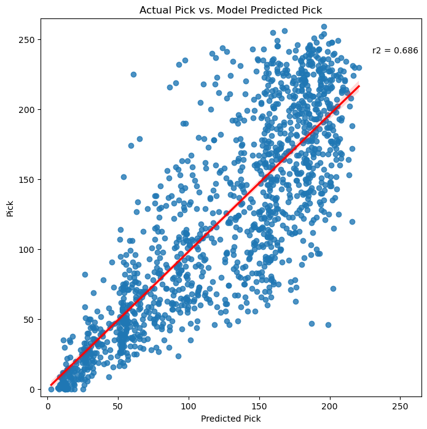

# NFL Draft Scouting Reports and Predictions

# **Author**: Josh Palgon

## Overview

The NFL Draft is the most important process in acquiring talented players. I am going to give any prespective team insight into when players will be selected.

I will be building upon the [Draft Combine](https://github.com/jpalgon/Draft_Stats) project I already completed.

The combine and college stats data was web scraped from sports-reference.com in the Draft Combine project. The scouting reports and draft grades were taken from ESPN.

The length of the scouting report is a decent indicator of where in the draft a player will be taken.

Overall player rank and draft grade were by far the most important features in determining where a player will get selected. This not surprising at all as teams are trying to pick the best players. 

My model was better at predicting the first round of the draft than any other round.

## Business Problem

Any NFL team is always looking for any minor edge to build a better football team. With the NFL Draft being the best way to improve a team, being able to know when a player will get drafted would be extremely valuable.

There are several significant applications to predicting when a player will get drafted. The biggest may be knowing what range a team will have to trade up to select a player of interest to them. If a team trades up too early they will have to give up extra draft capital to acquire the player and if they wait too long they will miss out on the player entirely. My model can give them a more precise range so they can maximize their draft capital while being able to acquire the player of interest. Additionally it could be used for tie-breaker scenarios. By selecting the player who is likely to get drafted earlier, there is a chance that they can select the other player later in the draft.

## Data

The combine and college stats data was web scraped from sports-reference.com. One major obstacle in scraping sports-reference is the secondary statistics for a player appear to be unscrapable. For example for QBs I only have their passing data but not their rushing information. While this is obviously not ideal, the addition of the combine testing data and scouting reports should help offset the loss of secondary information.

I used a sleep-timer of 3.15 to adhere to sports-references web scraping restrictions. They do update their page so I proved the link here https://www.sports-reference.com/bot-traffic.html in case anyone trying to replicate this process runs into any 429 HTTP Error requests.

To get the scouting reports from 2005-2021 I used a data set I found by [Jack Lichtenstein](https://www.kaggle.com/datasets/jacklichtenstein/espn-nfl-draft-prospect-data). I tried to scrape ESPN for the 2022 draft but the website was not scrapable so I just copied all the reports into an excel file as it was easy to copy for only one year.

Additionally, I supplemented the sportsreference data with the [NFL_data Python package](https://pypi.org/project/nfl-data-py/) for a few extra features.

## Modeling

For my modeling I separated my numeric columns from my categorical columns. On my categorical columns, I OneHotEncoded them. On my numerical columns, I used a simple imputer to handle the NaNs and impute 0 as any NaN should be 0 anyway based on how I scraped my data. Additionally, I used a StandardScaler on the numerical data.

I ran 7 different models:
- Linear Regression
- Decision Tree Regressor
- Random Forest Regressor (with CountVectorizer and TFIDF)
- KNN Regressor
- XGBoost Regressor
- ADABoost Regressor
- Gradient Boost Regressor (with CountVectorizer and TFIDF)

### Gradient Boost Regressor Plot

The Random Forest, XGBoost, ADABoost and Gradient Boost models all performed fairly well with a R Squared of 0.67 - 0.69. Additionally for the Gradient Boost and Random Forest, I did one set using CountVectorizer for the words in the scouting reports and another with TFIDF. The Gradient Boost Model with CountVectorizer on scouting reports had the highest R2 and the lowest Mean Squared Error so I chose it as my best model. 

## Evaluation

### Top Correlated Features with Pick

Overall rank and grade are the clear top correlated features. 

### Overall Rank

Clear linear relationship with the better ranked players get drafted in the earlier rounds.

### Report Length

The longer the scouting report, the more likely a player will be taken earlier in the draft.

### Important Words

Elite and great help separate round 1 from round 2 and those from the rest of the draft. Good and starter helps find players likely to be taken in rounds 1-3. Average and project show up more in the middle rounds with round 4 being the most frequent. Lack is most common at the end of the draft and is most frequent in round 5. All of this lines up with what would be expected.

## Conclusions

Overall Rank is the by far the most important feature in determining the pick number of a player. Grade while very similar to rank doesn't provide as much separation as rank so while a strong predictor isn't nearly as important.

The scouting reports and more important combine stats (40 yard dash, broad jump, speed score, and agility score) seem to weigh a bit heavier on where a player will get drafted than the basic college stats do. However there are a few offensive stats that carry some weight (scrimmage yards and tds in the season of the draft, and qb rating and yards per attempt for their careers). 

My model is very good at predicting players in the first round. Considering how important trading in the first round is, this is a very good development and can be a useful tool for a GM for the draft.

## Next steps:

Get more data
- Advanced stats
- Non Primary Stats
- Medical information? (not sure how to find good medical data for college prospects)
- Take team needs and draft order into account

Run my model on the 2023 draft to predict it before the 2023 draft happens. The combine will conclude at the beginning of March and the updated scouting reports should be available shortly after that. By mid-late March, I should have all the information I need to make a 2023 mock draft.

As the years go by and my database of drafts increases, I am hoping to get some better scores as well.

## For More Information

Please look at my full analysis in [my Jupyter Notebooks](./Notebooks) or my [presentation](./Draft_Scouting.pdf).

For any additional questions, please contact:

<ul>
    <li>Josh Palgon (jopalgon@gmail.com)</li>
</ul>
